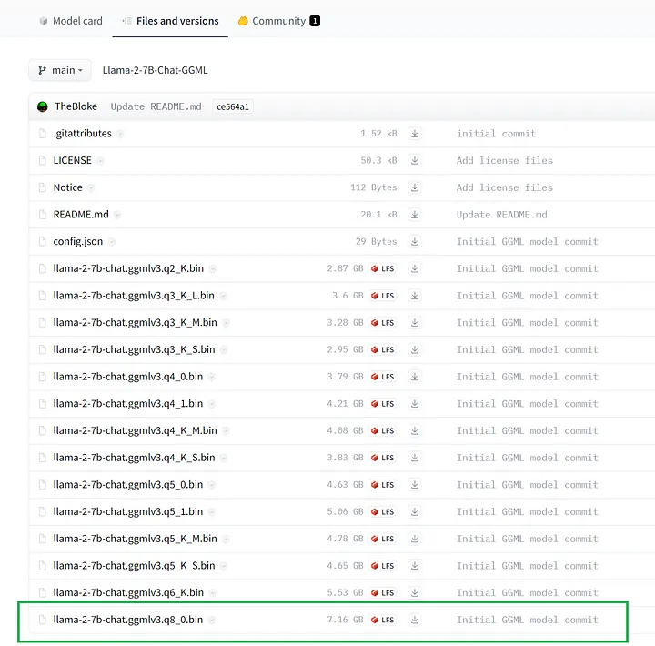
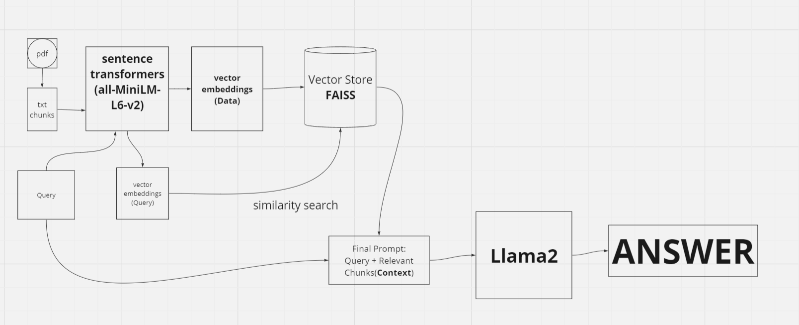
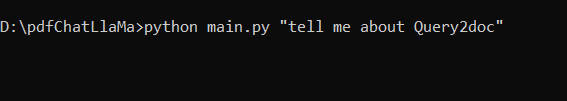
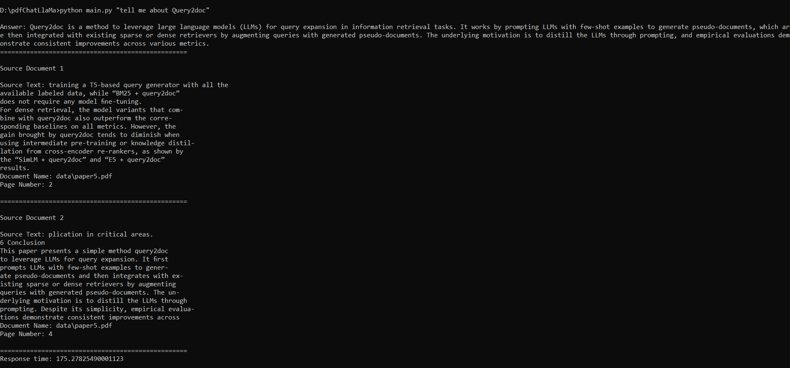

# PdfChat with llama2

## Table of Contents

- [Description](#description)
- [Installation](#installation)
- [Tech Stack](#tech-stack)
- [Flowchart](#flowchart)
- [Demo](#demo)
  - [Sample Query](#sample-query)
  - [Sample Output](#sample-output)

## Description

PdfChat is a application where you can chat with your research paper in pdf format. You can ask questions to your pdf and it will answer you. It is a fun way to interact with your pdf.

## Installation

1. Clone the repository
2. Install the requirements using the following command

```bash
pip install -r requirements.txt
```

3. Add your pdf files to the `data/` folder or you can use the sample pdf files provided in the folder.

4. Ensure you have downloaded the 8-bit quantised GGML binary file from https://huggingface.co/TheBloke/Llama-2-7B-Chat-GGML/tree/main and placed it into the `models/` folder



5. To start parsing user queries into the application, launch the terminal from the project directory and run the following command:

```bash
python main.py "<user query>"
```

```
Note:
The user query should be in double quotes.
It takes the application about 2-3 minutes to load the model, parse the query and provide an answer.
```

---

## Tech Stack

- [HuggingFace](https://huggingface.co/)
- [HuggingFace Embeddings](https://python.langchain.com/docs/integrations/providers/huggingface#embeddings)
- [Llama-7B-Chat](https://huggingface.co/TheBloke/Llama-2-7B-Chat-GGML/tree/main)
- [PyPDF2](https://pypi.org/project/PyPDF2/)
- [Langchain](https://python.langchain.com/)
- [all-MiniLM-L6-v2](https://huggingface.co/sentence-transformers/all-MiniLM-L6-v2)
- [CTransformers](https://python.langchain.com/docs/integrations/providers/ctransformers)
- [RetrievalQA](https://python.langchain.com/docs/integrations/providers/retrievalqa)
- [FAISS](https://python.langchain.com/docs/integrations/vectorstores/faiss)

## Flowchart


## Demo

### Sample Query

`Tell me about Query2doc?`



### Sample Output


